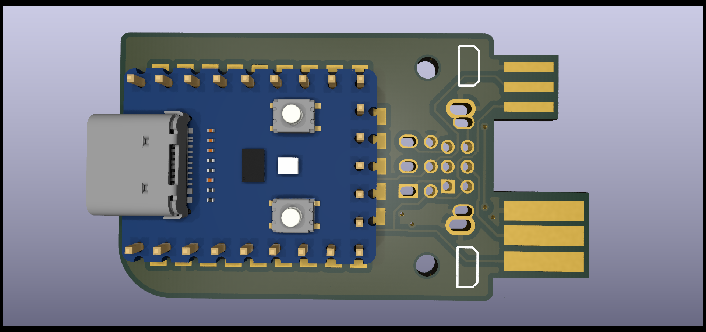
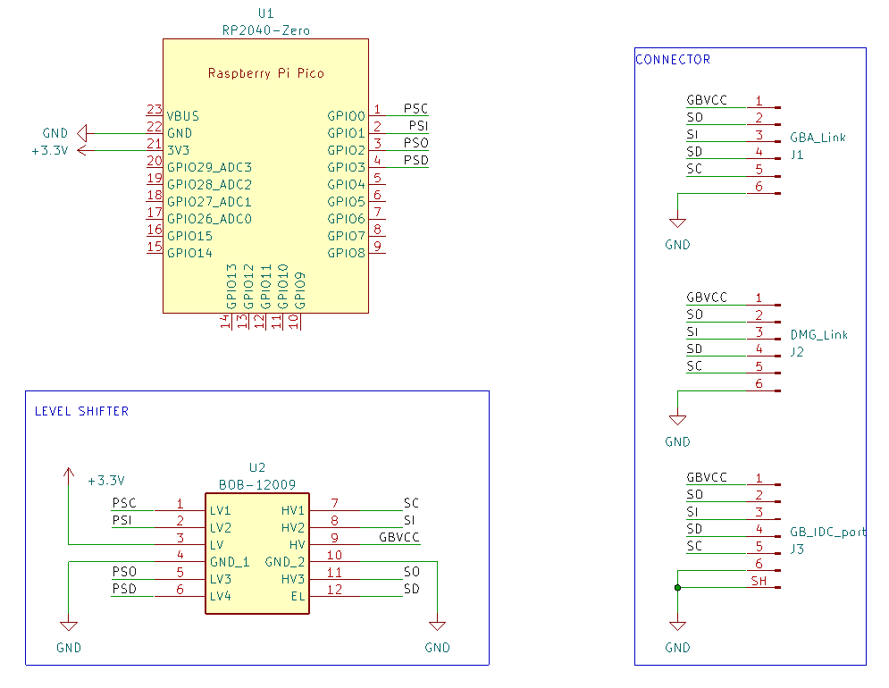

# Game-Boy-Zero-Link-Board

This project is forked from agtbaskara. This is the first time I'm using KiCad and Github. The experience is very pleasant to build on top of other people's work. Check out the [References](#References).

Like agtbaskara, this is another Open-Source USB to Gameboy Link Cable Adapter based around the smaller and cheaper RP2040-Zero. Designed with components that are easy to source and solder.

Game-Boy-Zero-Link-Board offers multiple options to connect your GB link cable.
- J1 GBA/GBC PCB Edge connector
- J2 DMG PCB Edge connector
- J3 DMG/GBA/GBC/IDC combined footprint

Game-Boy-Zero-Link-Board uses GBVCC (PIN1 of the GB link cable) to power the HV side of the Logic Level Converter. This allows the board to autmatically resolve the correct voltage on the GB side.

Based on stacksmashing Gameboy Link adapter: https://www.youtube.com/watch?v=KtHu693wE9o

# Schematic

# Required Components

| Reference | Part Number | Description |
|-|-|-|
| U1 | [RP2040-Zero] (https://www.waveshare.com/wiki/RP2040-Zero) | Waveshare RP2040-Zero |
| U1* | [RP2040-Zero] (https://www.aliexpress.com/item/1005005994987953.html) | AliExpress RP2040-Zero |
| U2 | [BOB-12009](https://www.sparkfun.com/products/12009) | Sparkfun Bi-Directional Logic Level Converter, clones are compatible |
| U2* | [BOB-12009](https://www.aliexpress.com/item/1005006068381598.html) |  AliExpress Bi-Directional Logic Level Converter|
| J1/J2 | [DMG-GBC-cable](https://www.aliexpress.com/item/1005004110251579.html) | AliExpress link cable suitable for DMG and GBC|
| J3 | [GBA_link] (https://www.aliexpress.com/item/1005006181192248.html) | AliExpress GBA link port |

**Attached links are for reference only, you can use any equivalent parts.**

# How to Order Board

To order a board, use the `gerbers*.zip` from the release page or generate one yourself. You can order from your favourite PCB manufacturer ([JLCPCB](https://jlcpcb.com/), [PCBWay](https://www.pcbway.com/), etc.).

**Use 1.2mm PCB thickness.**

You can choose any colour for the Solder Mask and Silkscreen. For the Surface Finish, ENIG is recommended.

# How to Assemble Board

1. Trim the Link Cable connectors width on the board to the appropriate size using a file tool or sandpaper
2. Solder pin header to RP2040-Zero and Level Shifter module. Use a breadboard for easier soldering
3. Solder RP2040-Zero and Level Shifter module to the board
4. Cut the excessive pin using a nipper tool
5. Solder the 1x3 Pin Header to the board, and place the Pin Jumper
6. Flash firmware to your RP2040-Zero (see [Compatibility](#Compatibility))

# How to Use Board

Connect the board to your PC, and connect the board to your Gameboy using a Link Cable.

# Compatibility

This board is compatible with the following firmware:
- https://github.com/stacksmashing/gb-link-firmware
- https://github.com/stacksmashing/gb-link-printer
- https://github.com/Lorenzooone/PokemonGB_Online_Trades
- https://github.com/dj505/GBPrinterEmu
- https://github.com/Squaresweets/GBPrinter-discord-bot
- https://github.com/KuestenKeks/pc-to-gb-printer

With some modification, it should be compatible with other firmware as well, such as:
- https://github.com/untoxa/pico-gb-printer

# References
- Game-Boy-Pico-Link-Board: https://github.com/agtbaskara/game-boy-pico-link-board
- Waveshare RP2040-Zero Footprint: https://files.waveshare.com/upload/f/f7/RP2040_Zero_stp.zip
- Logic Level Converter (BOB-12009) Footprint: https://www.snapeda.com/parts/BOB-12009/SparkFun%20Electronics/view-part/
- Gameboy Link Connector Footprint: https://github.com/Palmr/gb-link-cable
- Gameboy Link Port Footprint: https://github.com/Gekkio/gb-hardware
- 1.2mm PCB Thickness, based on: https://hackaday.io/project/12932-game-link-online/log/43999-received-the-breakout-boards
